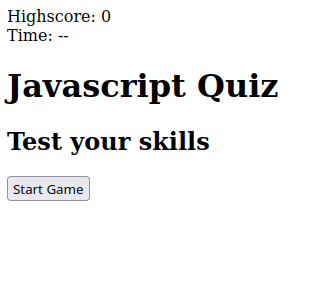
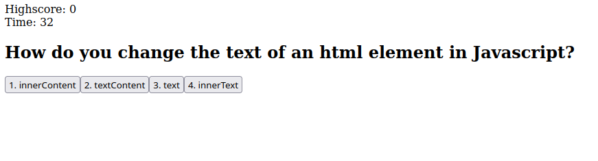

# javascript-quiz
This is a quiz for javascript. The website will ask questions and give the user a score. [The site can be accessed here.](https://zachary-berdell-elliott.github.io/javascript-quiz/)

## Technologies Used
* HTML
* CSS
* Javascript

## Features

### Timer
The timer runs for 40 seconds and tracks how much time the user has left and ends the quiz if the timer hits zero. 10 seconds are deducted if the user answers a question incorrectly.

### Score Saving
The user will be prompted to enter there name at the end of the quiz. The users score will then be saved to local storage.

### Questions
The questions are cycled and the user is presented with buttons that they can click. The buttons are presented in a multiple choice format.

### Score clearing
The user can clear the scores by clicking a clear scores button that will then remove the scores from the local storage.

## License
MIT

Copyright 2021 Zachary Elliott

Permission is hereby granted, free of charge, to any person obtaining a copy of this software and associated documentation files (the "Software"), to deal in the Software without restriction, including without limitation the rights to use, copy, modify, merge, publish, distribute, sublicense, and/or sell copies of the Software, and to permit persons to whom the Software is furnished to do so, subject to the following conditions:

The above copyright notice and this permission notice shall be included in all copies or substantial portions of the Software.

THE SOFTWARE IS PROVIDED "AS IS", WITHOUT WARRANTY OF ANY KIND, EXPRESS OR IMPLIED, INCLUDING BUT NOT LIMITED TO THE WARRANTIES OF MERCHANTABILITY, FITNESS FOR A PARTICULAR PURPOSE AND NONINFRINGEMENT. IN NO EVENT SHALL THE AUTHORS OR COPYRIGHT HOLDERS BE LIABLE FOR ANY CLAIM, DAMAGES OR OTHER LIABILITY, WHETHER IN AN ACTION OF CONTRACT, TORT OR OTHERWISE, ARISING FROM, OUT OF OR IN CONNECTION WITH THE SOFTWARE OR THE USE OR OTHER DEALINGS IN THE SOFTWARE.

